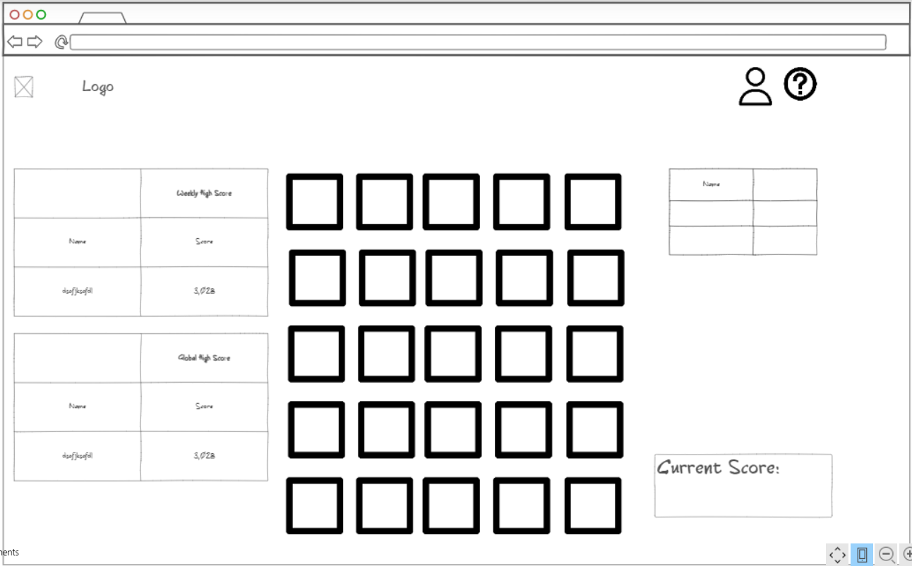

# startup-marathondle

## Specification Deliverable

### Elevator Pitch
For my startup I would like to bring a little more of a competitive edge to a game that I know many people enjoy: Wordle. I think that wordle is an entertaining game that has merit through the brain teasing quality it has. In my startup I would like to make a wordle game that allows you to log in and play until you lose, adding to your overall score the longer that you can go this game will be updating live for them. The more words you get correct the more points you will accumulate, there will be bonuses for getting the word sooner as well. Once you lose a game of wordle your run will end and your score will be saved. Your high score will be on display alongside your username so that you can see how other friends and players have done in comparison to you. I think it could also be fun to make the program reset the weekly high scores so that every week there could be a new top dog. The page would center around the game, with you and your friends scores on the right, and the weekly and global scores on the left. There would also be a current score displayed which showed the score currently earned in the current game.

Honestly this is my first time doing anything like this, and the idea excites me. However if it does not fit the class parameters or is not a good workload for a project please let me know!

### Design

### Key Features
The game will include:
Athentication: User will sign into their account
Database Data: user high scores
WebSocket data: when a user starts or ends a new game

### Technologies

I am going to use the required technologies in the following ways.
- **HTML** - Uses correct HTML structure for application. Two pages, one to log in and one for playing.
- **CSS** - Style my game so that it looks good and performs well on different screens, including making visible scoreboards.
- **JavaScript** - Create a login, and the wordle-esque game
- **Service** - Backend service with endpoints for:
- login
- retrieving words
- submitting answers
- retrieving scores
- **DB/Login** - Store users and their scores in database. Register and login users, credentials securely stored in database. Can't play unless authenticated.
- **WebSocket** - After a user finishes their game, their score is broadcast to all other users.
- **React** - Application ported to use the React web framework.

## HTML Deliverable
For this deliverable I built out the structure of my application using HTML

- [x] **HTML Pages** - 4 HTML Pages for login, game, score and about
- [x] **Links** - The login page automatically links to game page, all pages accessible through menu
- [x] **Text** - Each page has text describing what is happening
- [x] **Images** - I use an image as the background of the page
- [x] **DB/Login** - Input box and submit button for login
- [x] **Websocket** - In Scoreboard there is a 'news' section for the websocket

## CSS Deliverable

For this deliverable I properly styled the application into its final appearance.

- [x] **Header, footer, and main content body**
- [x] **Navigation elements** - Created a drop down menu for the navigation elements
- [x] **Responsive to window resizing** - My app looks great on all window sizes and devices
- [x] **Application elements** - Used good contrast and whitespace
- [x] **Application text content** - Consistent fonts that I feel fit the theme of my deliverable
- [x] **Application images** - Made it so that it fits the background no matter the size.

## JavaScript Deliverable

For this deliverable I implemented Javascript so that the application works for a user, and added placeholders for future technology.

- [x] **login** - When you press enter or the login button it takes you to the game.
- [x] **database** - Display in the scoreboard page the user scores that are saved in and retrieved from local storage, but will be taken from a database later on.
- [x] **WebSocket** - I used the setInterval function to periodically inform the user of other players and the score they just obtained, will replace with a websocket.
- [x] **application logic** - The game changes in style and score depending on user interaction.

## Service deliverable

For this deliverable I added backend endpoints that receives a single score and returns an object of player scores.

- [x] **Node.js/Express HTTP service** - done!
- [x] **Static middleware for frontend** - done!
- [ ] **Calls to third party endpoints** - I used the random quote third party endpoint as part of the welcome in my login page, also-I made a little 'easter egg' where if you pull up the console on the game page, a random Chuck Norris joke is generated!
- [x] **Backend service endpoints** - Endpoints for scores, get and post to update them between frontend and backend.
- [x] **Frontend calls service endpoints** - I did this using fetch to grab scores.
